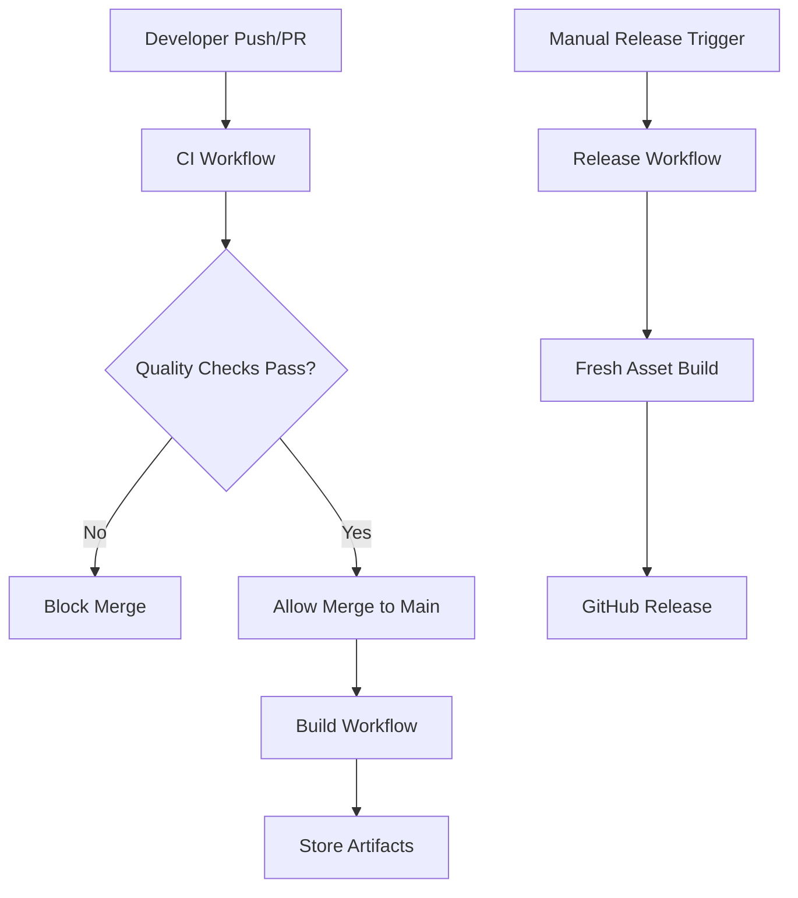

# GitHub Actions Workflows

This directory contains the comprehensive CI/CD pipeline for al.nvim.

## 🚀 Active Workflows

### [`ci.yml`](ci.yml)
**Continuous Integration & Quality Assurance**
- **Triggers**: Every push and pull request
- **Purpose**: Ensure code quality and prevent broken code from reaching main
- **Jobs**:
  - Lua code formatting (StyLua) and linting (Selene)
  - Go code formatting and linting (golangci-lint)
  - Documentation validation and TOML syntax checking
  - Plugin structure validation

### [`build.yml`](build.yml)
**Build & Package Assets**
- **Triggers**: Push to main branch, manual dispatch
- **Purpose**: Build and package all release assets for distribution
- **Jobs**:
  - Cross-platform Go proxy binary compilation
  - Complete plugin archive creation
  - Asset validation and integrity checks
  - Artifact storage for release pipeline

### [`release.yml`](release.yml)
**Release Management**
- **Triggers**: Manual dispatch only (workflow_dispatch)
- **Purpose**: Create professional GitHub releases with semantic versioning
- **Features**:
  - Semantic version calculation from conventional commits
  - Automated changelog generation
  - Cross-platform asset compilation with version embedding
  - Professional GitHub release creation with all assets
  - Support for pre-releases and draft releases

## 📋 Workflow Dependencies

## 🔧 Configuration Files

### Go Quality
- [`proxy-src/.golangci.yml`](../proxy-src/.golangci.yml) - golangci-lint configuration

### Lua Quality
- [`selene.toml`](../../selene.toml) - Selene linter configuration
- [`stylua.toml`](../../stylua.toml) - StyLua formatter configuration

## 📚 Documentation

- [`RELEASE_PIPELINE.md`](../../RELEASE_PIPELINE.md) - Comprehensive guide on using the release pipeline
- [`README.md`](../../README.md) - Main project documentation

## 🗂️ Deprecated Files

### [`build-proxy.yml`](build-proxy.yml)
**[DEPRECATED]** - Replaced by the comprehensive pipeline
- This was the original simple proxy build workflow
- Now disabled and kept only for reference
- Use the new CI/Build/Release pipeline instead

## 🎯 Quick Start

### For Development
1. **Make changes** in feature branches
2. **Create pull requests** - CI will automatically run quality checks
3. **Merge when green** - Build workflow will prepare assets

### For Releases
1. **Go to GitHub Actions** tab
2. **Select "Release" workflow**
3. **Click "Run workflow"**
4. **Configure version and options**
5. **Monitor the release process**

See [`RELEASE_PIPELINE.md`](../../RELEASE_PIPELINE.md) for detailed instructions.

## 🔍 Monitoring

### Workflow Status
- **Green checkmarks** ✅ - All workflows passing
- **Red X marks** ❌ - Issues need attention
- **Yellow circles** 🟡 - Workflows in progress

### Key Metrics
- **CI Success Rate** - Should be >95%
- **Build Time** - Typically 5-10 minutes total
- **Release Frequency** - Recommended monthly for minor releases

### Troubleshooting
- Check workflow logs for detailed error information
- Refer to troubleshooting section in [`RELEASE_PIPELINE.md`](../../RELEASE_PIPELINE.md)
- Common issues: formatting, linting, Go compilation errors

---

This pipeline ensures professional, reliable, and automated releases while maintaining high code quality standards.
