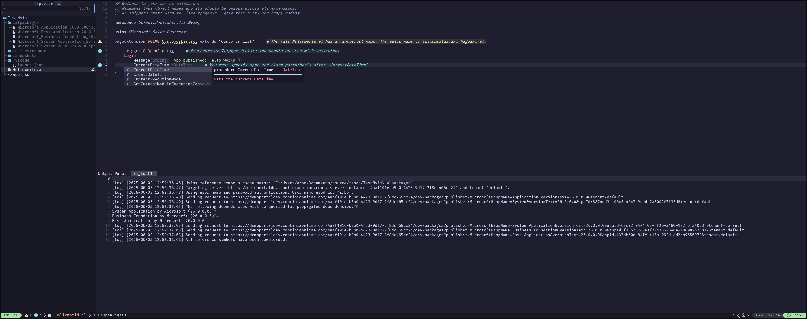
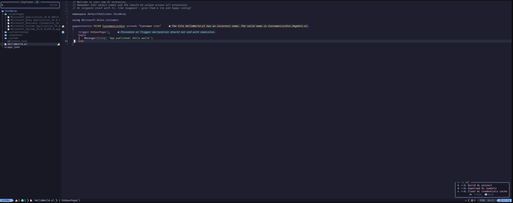

# al.nvim 🚀

A Neovim plugin that provides AL (Application Language) support for Microsoft Dynamics 365 Business Central development.

> **⚠️ Experimental Plugin**
> 
> This plugin is highly experimental and very much a work in progress. Features may be incomplete, unstable, or subject to breaking changes. Use at your own risk and expect rough edges. Contributions and feedback are welcome as we continue to develop and improve this plugin.

## ✨ Features

- **🧠 Language Server Protocol (LSP) Integration**: Full AL language server support with intelligent code completion, diagnostics, and navigation
- **📁 Filetype Detection**: Automatic detection and handling of `.al` files
- **🏗️ Project Management**: Workspace detection based on `app.json` and `.alpackages` files
- **🔨 Build System**: Integrated build commands for AL packages
- **📦 Symbol Management**: Download and manage AL symbols
- **🔐 Authentication**: Credential management and authentication handling
- **🐛 Debugging Support**: Full nvim-dap integration with AL debugger featuring:
  - **Cross-platform proxy solution** to solve stdio handle issues with AL EditorServices
  - **Automatic build integration** - builds your AL package before debugging
  - **Complete DAP protocol support** with message filtering and processing
  - **Multi-platform binaries** for Windows, Linux, macOS (Intel & Apple Silicon)
  - **Seamless nvim-dap integration** with dapui and virtual text support
- **📊 Progress Notifications**: Real-time feedback during AL operations
- **⚙️ Configurable Settings**: Extensive configuration options for LSP behavior and workspace settings

### 💻 Available Commands

The plugin provides an `:AL` command with the following subcommands:

- `:AL build` - 🔨 Build the current AL package
- `:AL downloadSymbols` - 📦 Download symbols with configuration selection
- `:AL clearCredentialsCache` - 🗑️ Clear cached credentials
- `:AL lsp` - 🔍 Display LSP client information and settings

## 📋 Requirements

- Neovim 0.9+ (some features require 0.10+)
- Microsoft AL Language Extension for VS Code (the plugin automatically detects and uses the AL language server from your VS Code extensions)
- **Cross-platform support**: Windows, Linux, and macOS (Intel & Apple Silicon)
  - *Note: While the debugging proxy supports all platforms, some AL language server features may work best on Windows*

## 🔗 Dependencies

This plugin requires the following Neovim plugins for full functionality:

### 🎨 UI Components
- **[nui.nvim](https://github.com/MunifTanjim/nui.nvim)** by [@MunifTanjim](https://github.com/MunifTanjim) - Provides UI components for configuration selection menus and interactive dialogs

nui.nvim is required for key features like symbol download configuration selection to work properly.

### 💡 Completion Engine
- **[blink.cmp](https://github.com/saghen/blink.cmp)** by [@saghen](https://github.com/saghen) - Modern completion engine with LSP support
  - *⚠️ Important Note*: LSP completion does not work out of the box with standard Neovim completion engines due to non-standard CompletionItem structures in the AL language server implementation. A transform method is required to properly handle completion items. See our [recommended installation with blink.cmp](#installation-with-blinkcmp-recommended) for a tested configuration.

### 🐛 Debugging Support
- **[nvim-dap](https://github.com/mfussenegger/nvim-dap)** by [@mfussenegger](https://github.com/mfussenegger) - Debug Adapter Protocol implementation for Neovim
- **[nvim-dap-ui](https://github.com/rcarriga/nvim-dap-ui)** by [@rcarriga](https://github.com/rcarriga) - UI components for nvim-dap debugging sessions
- **[nvim-nio](https://github.com/nvim-neotest/nvim-nio)** by [@nvim-neotest](https://github.com/nvim-neotest) - Async I/O library for Neovim
- **[nvim-dap-virtual-text](https://github.com/theHamsta/nvim-dap-virtual-text)** by [@theHamsta](https://github.com/theHamsta) - Inline variable display during debugging

*⚠️ Note: These debugging dependencies are currently required but will be made optional in future releases.*

### 🔧 Optional Plugins

- **[output-panel.nvim](https://github.com/mhanberg/output-panel.nvim)** by [@mhanberg](https://github.com/mhanberg) - Recommended for viewing LSP server window/logMessage calls, which can be helpful for debugging AL language server issues
  - *⚠️ Note: This plugin may experience issues when using the AL debugger*

## 🎯 Quick Start

1. **Install the Microsoft AL Language Extension** in VS Code if you haven't already
2. **Add the plugin** to your lazy.nvim configuration:
   ```lua
   {
     "abonckus/al.nvim",
     ft = "al",
     dependencies = {
       "MunifTanjim/nui.nvim",
     },
     opts = {},
   }
   ```
3. **Open an AL file** (`.al` extension) and the plugin will automatically activate
4. **Start coding!** 🎉

## 📦 Installation

### Using [lazy.nvim](https://github.com/folke/lazy.nvim)

```lua
{
  "abonckus/al.nvim",
  ft = "al",
  dependencies = {
    "MunifTanjim/nui.nvim",
    -- For debugging support (currently required, will be made optional in future)
    "mfussenegger/nvim-dap",
    "rcarriga/nvim-dap-ui",
    "nvim-neotest/nvim-nio",
    "theHamsta/nvim-dap-virtual-text",
  },
  opts = {
    -- your configuration here
  },
}
```

### 🌟 Installation with blink.cmp (Recommended)

For the best completion experience with AL language server, install with blink.cmp using this tested configuration:

```lua
{
  "abonckus/al.nvim",
  ft = "al",
  opts = {
    -- your configuration here
  },
},
{
  "saghen/blink.cmp",
  opts = {
    sources = {
      default = { "lsp", "path", "snippets", "buffer" },
      providers = {
        lsp = {
          transform_items = function(_, items)
            for _, item in ipairs(items) do
              if item.label.label then
                item.label = item.label.label
              end
            end
            return items
          end,
        },
      },
    },
  },
}
```

*✅ Note*: This blink.cmp configuration is tested and works with this plugin. The transform method handles non-standard CompletionItem structures from the AL language server.

## ⚙️ Configuration

The plugin comes with sensible defaults but can be extensively configured using lazy.nvim:

```lua
{
  "abonckus/al.nvim",
  ft = "al",
  opts = {
    vscodeExtensionsPath = "~\\.vscode\\extensions\\",
    
    workspace = {
      alResourceConfigurationSettings = {
        assemblyProbingPaths = { "./.netpackages" },
        codeAnalyzers = {
          "${CodeCop}",
          "${UICop}",
          "${PerTenantExtensionCop}",
          "${AppSourceCop}",
          "${analyzerFolder}BusinessCentral.LinterCop.dll",
        },
        enableCodeAnalysis = true,
        backgroundCodeAnalysis = true,
        packageCachePaths = { "./.alpackages" },
        ruleSetPath = ".vscode/ruleset.json",
        enableCodeActions = true,
        incrementalBuild = false,
        outputAnalyzerStatistics = false,
        enableExternalRulesets = true,
      },
    },
    
    lsp = {
      telemetryLevel = "all", -- "none" | "crash" | "error" | "all"
      browser = "SystemDefault", -- "SystemDefault" | "Chrome" | "Firefox" | "Edge" | "EdgeBeta"
      inlayHintsParameterNames = true,
      inlayHintsFunctionReturnTypes = true,
      semanticFolding = true,
      extendGoToSymbolInWorkspace = true,
      extendGoToSymbolInWorkspaceResultLimit = 100,
      extendGoToSymbolInWorkspaceIncludeSymbolFiles = true,
      log = {
        path = "",
        level = "Normal", -- "Debug" | "Verbose" | "Normal" | "Warning" | "Error"
      },
    },
  },
}
```

### Configuration Options

#### Workspace Settings
- `assemblyProbingPaths`: Paths to search for .NET assemblies
- `codeAnalyzers`: List of code analyzers to use (supports all AL code cops: CodeCop, UICop, PerTenantExtensionCop, AppSourceCop, and external analyzers like LinterCop)
- `enableCodeAnalysis`: Enable/disable code analysis
- `backgroundCodeAnalysis`: Run code analysis in the background
- `packageCachePaths`: Paths for AL package cache
- `ruleSetPath`: Path to custom ruleset file
- `enableCodeActions`: Enable code actions and quick fixes
- `incrementalBuild`: Enable incremental builds
- `enableExternalRulesets`: Allow external ruleset files

#### LSP Settings
- `telemetryLevel`: Control telemetry data sent to Microsoft
- `browser`: Default browser for AL operations
- `inlayHints*`: Enable parameter names and return type hints
- `semanticFolding`: Enable semantic-based code folding
- `extendGoToSymbolInWorkspace`: Enhanced symbol search across workspace
- `log`: Logging configuration for the AL language server

## 📁 Project Structure

The plugin expects AL projects to follow the standard structure:

```
your-al-project/
├── app.json                 # AL app manifest
├── .alpackages/            # Symbol packages
├── .vscode/
│   ├── launch.json         # Debug configurations
│   └── ruleset.json        # Code analysis rules
└── src/                    # AL source files
    └── *.al
```

## 🚀 Usage

1. Open an AL file (`.al` extension) in Neovim
2. The plugin will automatically:
   - Detect the AL filetype
   - Start the AL language server
   - Provide LSP features like completion, diagnostics, and navigation

3. Use the `:AL` command for various operations:
   ```vim
   :AL build                    " Build the current package
   :AL downloadSymbols          " Download symbols
   :AL clearCredentialsCache    " Clear credentials
   ```

## 🐛 AL Debugging with nvim-dap

al.nvim provides full debugging support through nvim-dap integration, solving critical compatibility issues with the AL EditorServices.

### The Challenge

When attempting to use AL debugging directly with nvim-dap, the AL EditorServices crashes with stdio handle errors:

```
System.IO.IOException: The handle is invalid.
at System.ConsolePal.SetConsoleInputEncoding(Encoding enc)
```

This occurs because the AL EditorServices expects proper console handles, but nvim-dap's process spawning doesn't provide them correctly.

### Our Solution: Debug Proxy

We developed a lightweight Go-based proxy that sits between nvim-dap and the AL EditorServices:

```
nvim-dap ↔ al-debug-proxy ↔ AL EditorServices ↔ Business Central
```

The proxy:
- **Solves stdio handle issues** by providing proper console initialization
- **Forwards all DAP protocol messages** transparently between nvim-dap and AL EditorServices
- **Handles process lifecycle** including cleanup and signal management
- **Processes DAP messages** to fix protocol inconsistencies
- **Supports all platforms** with optimized binaries for Windows, Linux, and macOS

### Getting Started

1. **Install nvim-dap dependencies**:
   ```lua
   {
     "mfussenegger/nvim-dap",
     dependencies = {
       "rcarriga/nvim-dap-ui",
       "theHamsta/nvim-dap-virtual-text",
     },
   }
   ```

2. **Configure your `.vscode/launch.json`** with AL debug settings

3. **Start debugging** with standard nvim-dap commands:
   ```vim
   :DapToggleBreakpoint    " Set breakpoints
   :DapContinue           " Start debugging
   ```

The plugin automatically builds your AL package before debugging and handles all the proxy communication seamlessly.

For detailed technical information about the proxy implementation, see [DEBUGGING.md](DEBUGGING.md).

### Building from Source

The plugin includes pre-built proxy binaries for all supported platforms in the `bin/` directory. If you need to build the proxy yourself:

```bash
# Unix systems (Linux/macOS)
cd proxy-src && ./build.sh

# Windows
cd proxy-src && build.bat
```

Requires Go 1.21+ to build from source.

## 🔧 Troubleshooting

### ❌ Language Server Not Starting
- Ensure the Microsoft AL Language Extension is installed in VS Code
- Check that `vscodeExtensionsPath` points to your VS Code extensions directory
- Verify that `app.json` exists in your project root
- Try restarting Neovim or running `:LspRestart`

### 🔨 Build Issues
- Ensure your project has a valid `app.json` file
- Check that all dependencies are properly configured
- Verify that the AL compiler is accessible
- Make sure you're in the correct workspace directory

### 🔐 Authentication Problems
- Use `:AL clearCredentialsCache` to reset stored credentials
- Check your launch.json configuration for correct server settings
- Verify your Business Central server connection details

### 💡 Completion Not Working
- Ensure you're using the recommended blink.cmp configuration with the transform method
- Check that the AL language server is running (`:AL lsp`)
- Verify that LSP is attached to the current buffer (`:LspInfo`)

### 📦 Symbol Download Issues
- Check your internet connection
- Verify your authentication credentials are correct
- Ensure the selected configuration in launch.json is valid
- Try clearing credentials cache and re-authenticating

### 🐛 Debugging Issues
- **AL Debugger Not Starting**: The plugin uses a proxy to solve stdio handle issues with nvim-dap. If debugging fails, ensure the proxy binary exists in the `bin/` directory
- **"Handle is invalid" Error**: This error is solved by the proxy approach - make sure you're using the latest version of the plugin
- **Debugger Connection Issues**: Check your launch.json configuration and ensure your Business Central server is accessible
- **Breakpoints Not Working**: Verify that your AL code is published to the server and that the debugger is attached to the correct session

## 🎨 Showcase

Here's a complete AL development environment setup using al.nvim with a modern Neovim configuration:

### 🛠️ Featured Setup

This showcase demonstrates a fully configured AL development environment with:

- **[LazyVim](https://github.com/LazyVim/LazyVim)** by [@folke](https://github.com/folke) - Modern Neovim configuration framework
- **[blink.cmp](https://github.com/saghen/blink.cmp)** by [@saghen](https://github.com/saghen) - Fast completion engine with AL language server support
- **[which-key.nvim](https://github.com/folke/which-key.nvim)** by [@folke](https://github.com/folke) - Key binding helper and documentation
- **[output-panel.nvim](https://github.com/mhanberg/output-panel.nvim)** by [@mhanberg](https://github.com/mhanberg) - LSP output and log viewer
- **[nvim-treesitter](https://github.com/nvim-treesitter/nvim-treesitter)** with **[tree-sitter-al](https://github.com/SShadowS/tree-sitter-al)** by [@SShadowS](https://github.com/SShadowS) - Advanced syntax highlighting and code analysis

### 📸 Screenshots


*Complete AL development setup with LSP diagnostics, completion, and syntax highlighting*


*Real-time code analysis with multiple AL code cops and error reporting*

### ⚙️ Complete Configuration

```lua
-- LazyVim configuration for AL development
return {
  -- AL Language Support
  {
    "abonckus/al.nvim",
    ft = "al",
    lazy = false,
    dependencies = {
      "MunifTanjim/nui.nvim",
      "mfussenegger/nvim-dap",
      "rcarriga/nvim-dap-ui",
      "nvim-neotest/nvim-nio",
      "theHamsta/nvim-dap-virtual-text",
    },
    opts = {
      vscodeExtensionsPath = "~\\.vscode\\extensions\\",
      workspace = {
        alResourceConfigurationSettings = {
          codeAnalyzers = {
            "${CodeCop}",
            "${analyzerFolder}BusinessCentral.LinterCop.dll",
          },
          enableCodeAnalysis = true,
          backgroundCodeAnalysis = true,
        },
      },
    },
  },

  -- Enhanced completion with AL support
  {
    "saghen/blink.cmp",
    opts = {
      sources = {
        default = { "lsp", "path", "snippets", "buffer" },
        providers = {
          lsp = {
            transform_items = function(_, items)
              for _, item in ipairs(items) do
                if item.label.label then
                  item.label = item.label.label
                end
              end
              return items
            end,
          },
        },
      },
    },
  },

  -- LSP output panel for debugging
  {
    "mhanberg/output-panel.nvim",
    event = "VeryLazy",
    keys = {
      { "<leader>op", "<cmd>OutputPanel<cr>", desc = "Toggle Output Panel" },
    },
    config = true,
  },

  -- Treesitter with AL parser
  {
    "nvim-treesitter/nvim-treesitter",
    opts = {
      ensure_installed = {
        "al",
        -- other languages...
      },
    },
    config = function(_, opts)
      -- Register AL parser
      local parser_config = require("nvim-treesitter.parsers").get_parser_configs()
      parser_config.al = {
        install_info = {
          url = "https://github.com/SShadowS/tree-sitter-al",
          files = { "src/parser.c" },
          branch = "main",
        },
        filetype = "al",
      }
      
      require("nvim-treesitter.configs").setup(opts)
    end,
  },

  -- Which-key mappings for AL commands
  {
    "folke/which-key.nvim",
    opts = {
      spec = {
        { "<leader>a", group = "AL Development", icon = "AL" },
        { "<leader>ab", "<cmd>AL build<cr>", desc = "Build AL Package", icon = "AL" },
        { "<leader>as", "<cmd>AL downloadSymbols<cr>", desc = "Download Symbols", icon = "AL" },
        { "<leader>ac", "<cmd>AL clearCredentialsCache<cr>", desc = "Clear Credentials", icon = "AL" },
      },
    },
  },
}
```

### ✨ Features in Action

- **🎯 Intelligent Code Completion** - Context-aware AL object and method suggestions
- **🔍 Real-time Diagnostics** - Instant feedback from all enabled code analyzers
- **🌈 Advanced Syntax Highlighting** - Tree-sitter powered highlighting for AL constructs
- **⚡ Quick Actions** - Which-key integration for fast AL command access
- **📊 LSP Monitoring** - Output panel for debugging language server issues
- **🔨 Integrated Build System** - One-command building and symbol management

This setup provides a complete, modern AL development experience that rivals traditional IDEs while maintaining the speed and flexibility of Neovim.

## 📚 Additional Resources

- **[AL Language Documentation](https://docs.microsoft.com/en-us/dynamics365/business-central/dev-itpro/developer/devenv-programming-in-al)** - Official AL programming guide
- **[Business Central Developer Documentation](https://docs.microsoft.com/en-us/dynamics365/business-central/dev-itpro/)** - Complete developer resources
- **[AL Language Extension](https://marketplace.visualstudio.com/items?itemName=ms-dynamics-smb.al)** - VS Code extension this plugin depends on

## 🤝 Contributing

This plugin is in active development. Contributions are welcome! Please:

1. Fork the repository
2. Create a feature branch
3. Make your changes
4. Add tests if applicable
5. Submit a pull request

## 🙏 Acknowledgments

- **Microsoft Corporation** for the AL Language Server and Business Central platform
- **The Neovim LSP team** for the excellent LSP infrastructure that makes this plugin possible
- **[@MunifTanjim](https://github.com/MunifTanjim)** for [nui.nvim](https://github.com/MunifTanjim/nui.nvim) - Essential UI components
- **[@saghen](https://github.com/saghen)** for [blink.cmp](https://github.com/saghen/blink.cmp) - Modern completion engine with AL support
- **[@folke](https://github.com/folke)** for [LazyVim](https://github.com/LazyVim/LazyVim) and [which-key.nvim](https://github.com/folke/which-key.nvim) - Modern Neovim framework and key binding system
- **[@mhanberg](https://github.com/mhanberg)** for [output-panel.nvim](https://github.com/mhanberg/output-panel.nvim) - LSP output and log viewer
- **[@SShadowS](https://github.com/SShadowS)** for [tree-sitter-al](https://github.com/SShadowS/tree-sitter-al) - AL syntax highlighting support
- **[@mfussenegger](https://github.com/mfussenegger)** for [nvim-dap](https://github.com/mfussenegger/nvim-dap) - Debug Adapter Protocol implementation
- **[@rcarriga](https://github.com/rcarriga)** for [nvim-dap-ui](https://github.com/rcarriga/nvim-dap-ui) - Debug UI components
- **[@theHamsta](https://github.com/theHamsta)** for [nvim-dap-virtual-text](https://github.com/theHamsta/nvim-dap-virtual-text) - Inline debug information
- **The AL/Business Central development community** for feedback, testing, and contributions
- **The Go programming language team** for the tools that made our cross-platform proxy possible

---

**Note**: This plugin is not affiliated with Microsoft Corporation. AL and Business Central are trademarks of Microsoft Corporation.
